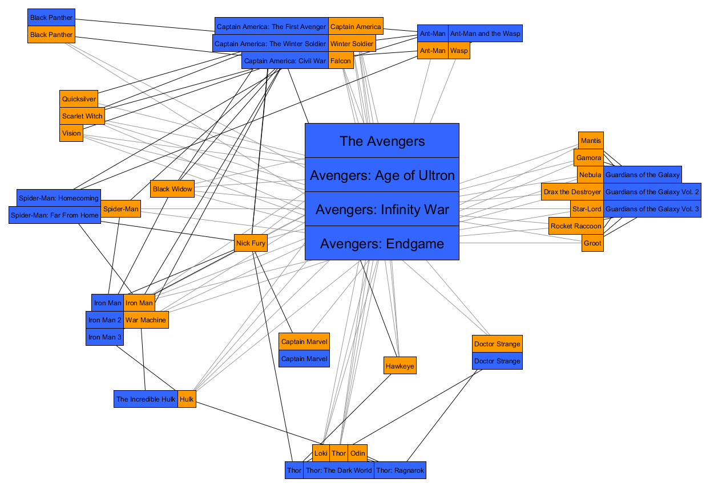

# InfoVis
Course of Information Visualization (JavaScript, D3)

## Project_1 (text): 
Create a file with trivial data: there are 20 data points and each data point has three variables quantitative (cultural values are positive). First draw this dataset using a diagram "texture of stars" [StarPlot] (each variable has an axis, all axes radiate from the same point) in which the first variable is used for the first axis, the second variable is used for the third axis. Clicking the mouse button on an axis reverses it (the origin ends at the top). By clicking in the space between two they exchange places.
Some files have been taken as an example from another site, to be able to face the project

## Project_2 : Marvel Cinematografic Universe
Graphic representation of the film world of Marvel
The Marvel Cinematic Universe is a media franchise and shared universe that is centered on a series of superhero films, based on characters that appear in comic books published by Marvel. The data set describes a selection of 28 characters (heroes) and in which of the 24 movies released so far they appeared.

The data was compiled from the Marvel Cinematic Universe Wiki: https://marvelcinematicuniverse.fandom.com/wiki/Marvel_Cinematic_Universe_Wiki

The graph is provided in GraphML format. Each node has a data key type that describes whether it corresponds to a hero or to a movie, and a data key name that contains the name of the hero or the title of the movie. There is an edge between a hero-node and a movie-node if the hero appeared in the corresponding movie.
